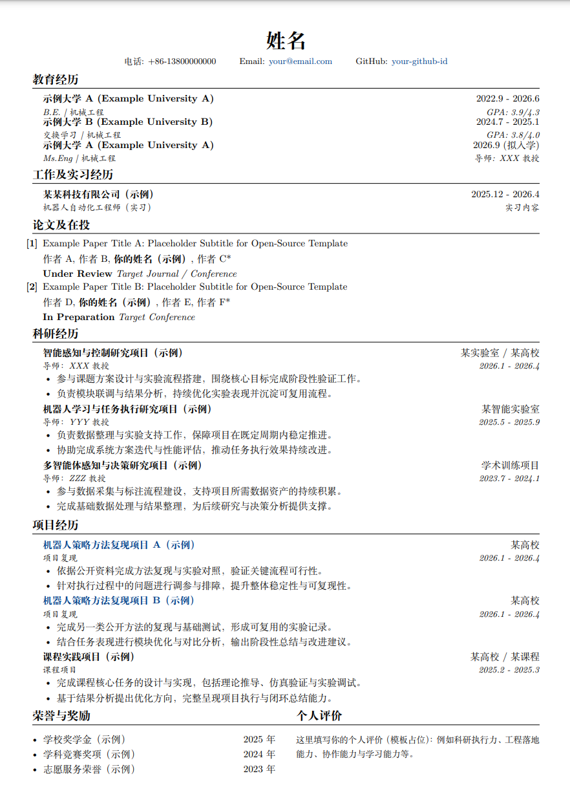

# LaTeX 中文简历模板

一个简洁、紧凑、适合中文场景的 LaTeX 简历模板。

## 文件说明

- `resume_templete.tex`：开源模板

## 模板特点

- 中文友好：基于 `ctex`，支持中文内容排版
- 布局紧凑：页边距和段间距已优化，适合一页简历
- 结构清晰：教育、实习、论文、科研、荣誉等模块开箱即用

## Overleaf 一键使用

[Overleaf 一键模板](https://www.overleaf.com/docs?snip_uri=https%3A%2F%2Fgithub.com%2FSelfGala%2Fresume_templete%2Farchive%2Frefs%2Fheads%2Fmain.zip&engine=xelatex&main_document=resume_templete.tex)

## Demo

## 许可证

本项目采用 MIT License，详见 [LICENSE](LICENSE)。

---

如果这个模板对你有帮助，欢迎点个 Star。
